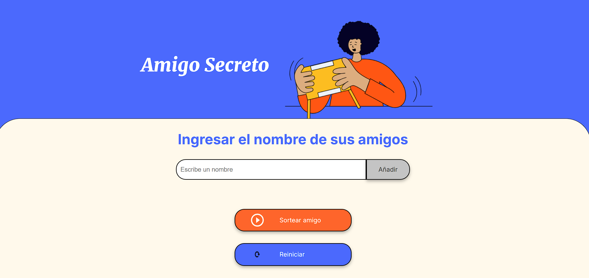

# 🎁 Amigo Secreto

Este es un proyecto simple hecho con **HTML, CSS y JavaScript puro**, que permite realizar un sorteo de amigo secreto de manera rápida y sencilla.

🔗 **Demo en GitHub Pages:** [Amigo Secreto](https://jhoncodev.github.io/amigo-secreto/)

## 📸 Captura de Pantalla



## 🚀 Características
✅ Agregar nombres de amigos uno por uno.
✅ Sortear aleatoriamente el amigo secreto con un botón.
✅ Reiniciar el sorteo y empezar de nuevo.
✅ Interfaz simple y fácil de usar.

## 🛠️ Tecnologías Utilizadas
- **HTML** → Estructura de la página.
- **CSS** → Estilos y diseño.
- **JavaScript** → Lógica del sorteo y manejo de eventos.

## 📥 Instalación y Uso
Si quieres probarlo localmente:

1. Clona el repositorio:
   ```sh
   git clone https://github.com/jhoncodev/amigo-secreto.git
   ```
2. Abre el archivo `index.html` en tu navegador.

## 📌 Mejoras Futuras
🔹 Guardar los nombres en `localStorage` para que no se pierdan al recargar la página.
🔹 Mejorar la interfaz y agregar animaciones.
🔹 Opción para exportar los resultados en PDF o imagen.

## 🤝 Contribución
Si tienes ideas para mejorar este proyecto, ¡siéntete libre de hacer un **fork** y enviar un **pull request**!

---
🚀 *Desarrollado por [jhoncodev](https://github.com/jhoncodev/)*
